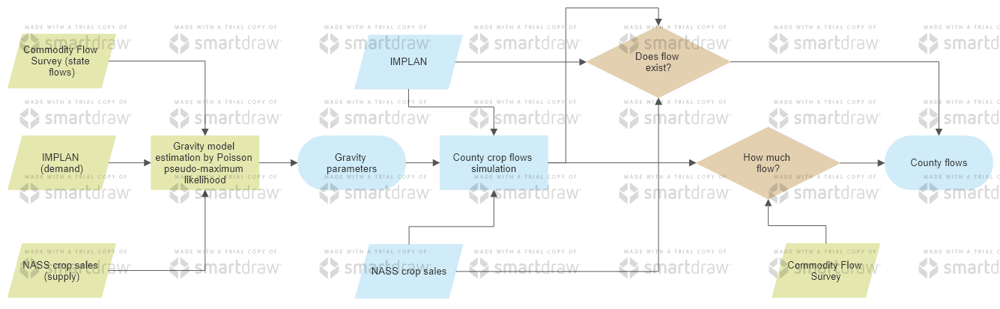

# Creating county food flows

**Objective:** Build `output/dyadic_county_flows_adjusted.rds` datasets. These datasets are identical (`.rds` is a data object, and `.dta` is a Stata dataset). The following four (4) scripts are required to run in order. Notice that `data/cfs_cleaned_data` and `data/data_needs` are not in repository. Request [Noé J Nava](mailto:noejn2@illinois.edu) these two directories. Other R and Stata scripts are not necessary to build these datasets, but they are complimentary in the study of the reliability of our dataset or to create figures.

### 1) `code/dyadic_county_construction.R`

**Creates:** `output/dyadic_county_2017.rds`

**Requires:** 
- `data/data_needs/location_master_key.csv`
- `data/data_needs/NASS SCTG02 sales by county.dta`
- `data/data_needs/acreage_2017.csv`
- `data_industry_export_cleaned_2017.csv` [1](#footnote1)
- `data/county_tools.dta`
- `assets/shp_file/3109_county` these are shapefiles.
- `assets/county_areas.csv`

### 2) `code/state_gravity_reg.do`

**Creates:** `output/dyadic_state_2017_merge.dta` and `output/st_trade_flows.dta`.

**Requires:** 
- `data/cfs_cleaned_data`
- `data/data_needs/dyadic_state_2017`
- `data/data_needs/dyadic_state_2012`

### 3) `code/istrade_cnty_probs.R`

**Creates:** `output/dy_cnty_probs.rds`

**Requires:**
- `output/st_trade_flows.dta`
- `output/dyadic_county_2017.rds`

### 4) `code/trade_interpolation_bayes.R`

**Creates:** `output/dyadic_county_flows_adjusted.rds`.

**Requires:** 
- `output/dyadic_county_2007.rds` [2](#footnote1)
- `output/dyadic_state_2017_merge.dta` [3](#footnote1)
- `output/dy_cnty_probs.rds` [4](#footnote1)

Below we show an schematic work flow of our procedure. For the purpose of code description (not the report/publication document), I indicate the scripts that represent each part of the work flow as well as the output. This is simply done to aid with replication and collaboration.

- The column one and two (in green) refers to the gravity estimation in point two above: `code/state_gravity_reg.do`. The first one is datasets required for the state gravity estimation; this data is in `data\data_needs` and `data\cfs_cleaned_data` and Noé has the data. Thus, the second column refers to the work done in the `code/state_gravity_reg.do` script. This part also spits out the gravity parameters.
- An additional set of information is the probability of a dyadic relationship having non-zero trade. This is created in `code/istrade_cnty_probs.R`.
- `code/trade_interpolation.R` represents the data creation referred to as Commodity crop flows simulation in the schematic work flow. It requires two things. One is the gravity parameters from the previous step. The second is the dataset created by `code/dyadic_county_construction.R`. This data set refers to IMPLANa and NASS datasets. The corrections refer to as "does flow exist?" and "how much?" are in the this script too. 
- Not showed here since I am not paying the trial until the end, but there will be a 
- The final output, referred to as "county flows" is `output/dyadic_county_flows_adjusted.rds`.

The following scripts are complementary to this simulation:

- `code/FE_formula.R` is used to demonstrate that the correction to include the FEs associated with WA and LA in `code/trade_interpolation.R` carries no bias i.e., the code is correct.
- `code/check_predict.do` is used to demonstrate that the formula used in R in `code/trade_interpolation.R` is the same as any Stata's predict command.
- `code/data_checks.R` performs several checks and comparisons between our dataset and the dataset in Lin, Ruess, Marston and Konar (2019) dataset which here is titled: `data/cntyflows_12_lin_2019.csv`. The data checks include: imports/exports maps, and descriptive statistics.
`code/cfs_faf_17_comparison.R` performs summary of statistics for cfs and faf data to be used in the document.

1 Please see IMPLAN repository to see how to create this dataset. .
2 This is created in step 1 here. .
3 This is created in step 2 here. .
